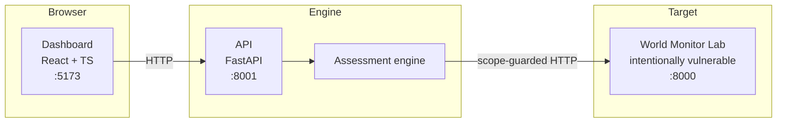

# Architecture

AuthGraph Sentinel is a three-tier system: a target to assess, an engine that
assesses it, and a dashboard to read the results.

## Tiers

### 1. Target - `sentinel-lab/`
A small FastAPI app (`World Monitor`) that deliberately contains access-control
flaws (BOLA/IDOR, broken RBAC, privilege escalation, a forgeable session token,
excessive data exposure). It is the safe, masked stand-in for the real
application, and it exposes a lab-only `POST /api/_lab/reset` hook so the engine
can run destructive tests deterministically and restore known state afterwards.

**This service is intentionally insecure. Never expose it on a public network.**

### 2. Engine + API - `backend/`
The engine does the work; the API exposes it over HTTP.

| Module | Responsibility |
| --- | --- |
| `engine/http_client.py` | `ScopedClient` - the single outbound HTTP path, enforcing the authorized-host allowlist |
| `engine/discovery.py` | ingest OpenAPI, enumerate endpoints, build a per-role access map (read-only) |
| `engine/auth_analyzer.py` | inspect the session mechanism; reproduce token forgery |
| `engine/authorization.py` | build the authorization graph, apply policy, surface *suspected* violations |
| `engine/bola.py`, `engine/rbac.py` | *prove* violations by reproducing them; promote to *verified* |
| `engine/verification.py` | shared reset / redaction / re-test-scenario helpers |
| `models/graph.py`, `models/user.py`, `models/finding.py` | data models |
| `risk/cvss.py` | CVSS v3.1 base scoring |
| `reports/generator.py` | assemble the prioritized, redacted report |
| `api/*`, `main.py` | REST endpoints + app wiring |

### 3. Dashboard - `frontend/`
A React + TypeScript single-page app that calls the API: run an assessment, read
the severity summary, browse findings with evidence and remediation, view the
authorization graph, and read the report.

## Data flow for one assessment

1. The dashboard calls `POST /api/assessments`.
2. Discovery logs in as each role and maps which endpoints each can reach.
3. The auth analyzer inspects the session mechanism.
4. The authorization graph fuses identities, ownership, and observed access, then
   the policy layer flags access that should not be permitted (**suspected**).
5. The BOLA and RBAC detectors reproduce each suspected violation against the lab.
   Destructive tests are bracketed by a reset. Reproduced cases become **verified**.
6. Each verified result is scored (CVSS v3.1) and turned into a Finding with
   business impact, remediation, redacted evidence, and a re-test scenario.
7. The API serves the findings, graph, and report back to the dashboard.

## The scope guard

Every outbound request from the engine goes through `ScopedClient`, which refuses
any host not listed in `allowed_hosts`. This is the authorization boundary for the
whole tool: it cannot be bypassed by a detector, and it is why Sentinel can only
ever reach the target you configure. Under Docker the allowed host is `lab:8000`;
run locally it is `127.0.0.1:8000`. See `backend/app/config.py`.
